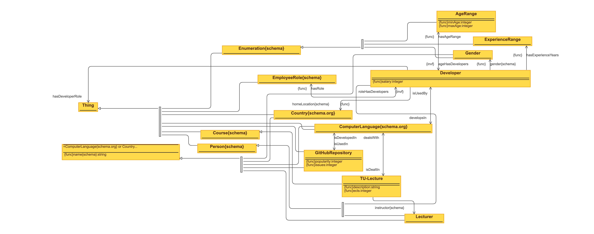

```{r setup, include=FALSE}
knitr::opts_chunk$set(echo = FALSE)
```

## App Idea

```{r logo, echo=FALSE}

```

_Study - Job - Money_

* For Software Developers and Data Scientists
* Asks for experience, age, location
* Answers:
  * _What shall I study?_
  * _Where shall I work?_
  * _What shall I practise?_
  * _How could I practise?_

## Data Sources

* **Kaggle User Survey**$\hfill\break$
  Data Scientists, Country, Job Role, Programming Language, Income
* **StackOverflow User Survey**$\hfill\break$
  Software Developer, Country, Job Role, Programming Language, Income
* **GitHub Repositories Data**$\hfill\break$
  Repository URL, Popularity, Programming Language, Issues
* **TISS Lectures**$\hfill\break$
  Lectures, Lecturer, Description, Programming Language

## Ontology

```{r ontology, echo=FALSE, out.width="100%"}

```

* Created with Protégé
* Reusing existing Ontologies
  * https://schema.org/Gender
  * https://schema.org/ComputerLanguage
  * https://schema.org/EmployeeRole
  * https://schema.org/Country
  * ...
  
## Data Processing #1

### Kaggle Survey

* https://www.kaggle.com/c/kaggle-survey-2019
* Used Jupyter Notebook for Pre-Processing
* Created RDF XML directly from Python
* **Challenge:** high number of one-hot-encoded values, had to extract unique values

### StackOverflow Survey

* https://insights.stackoverflow.com/survey/2018
* Used Python for Pre-Processing
* Created RDF XML directly from Python
* **Challenge:** Fighting with OpenREFINE - at the end reverted to manual

## Data Processing #2

### GitHub Repositories Data

* http://ghtorrent.org/
* Used Bash & R Script for Pre-Processing
* Created RDF XML directly from Python
* **Challenge:** _huge_ data archive (>100GB) had to be filtered / preprocessed

### TISS Lectures

* https://tiss.tuwien.ac.at/course/courseList.xhtml?dswid=6403&dsrid=238
* Used Python Script
* Created RDF XML directly from Python (using `rdflib`)
* **Challenge:** web scraping, identifying the programming language from text

## SPARQL Queries

```
PREFIX rdf: 
  <http://www.w3.org/1999/02/22-rdf-syntax-ns#>
PREFIX group1: 
  <http://www.semanticweb.org/sws/ws2019/group1#>
PREFIX schema: <http://schema.org/>

SELECT ?name
WHERE {
  ?lecture rdf:type group1:TU-Lecture .
  ?lecture schema:name ?name .
}
LIMIT 25
```
## Questions?