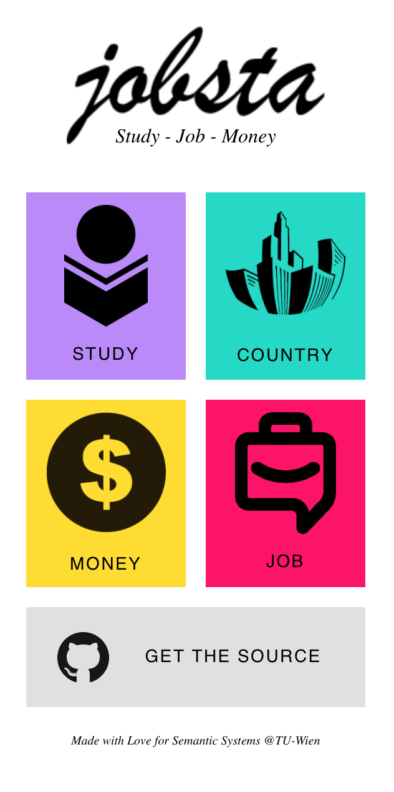

```{r setup, include=FALSE}
knitr::opts_chunk$set(echo = FALSE)
```

## App Idea

```{r logo, echo=FALSE, out.width="30%"}

```

_Study - Job - Money_

* For Software Developers and Data Scientists
* Asks for experience, age, location
* Answers to following questions:
    * _What shall I study?_
    * _Where shall I work?_
    * _What shall I practise?_
    * _How can I improve?_

## The Mobile App

```{r fig.align="center", out.width="40%"}

```

## Data Sources

* **Kaggle User Survey**$\hfill\break$
  Data Scientists, Country, Job Role, Programming Language, Income
* **StackOverflow User Survey**$\hfill\break$
  Software Developer, Country, Job Role, Programming Language, Income
* **GitHub Repositories Data**$\hfill\break$
  Repository URL, Popularity, Programming Language, Issues
* **TISS Lectures**$\hfill\break$
  Lectures, Lecturer, Description, Programming Language

## Kaggle Survey

* https://www.kaggle.com/c/kaggle-survey-2019
* Used Jupyter Notebook for Pre-Processing
* Created RDF XML directly from Python
* **Challenge:** high number of one-hot-encoded values, had to extract unique values

## StackOverflow Survey

* https://insights.stackoverflow.com/survey/2018
* Used Python for Pre-Processing
* Created RDF XML directly from Python
* **Challenge:** Fighting with OpenREFINE - at the end reverted to manual

## GitHub Repositories Data

* http://ghtorrent.org/
* Used Bash & R Script for Pre-Processing
* Created RDF XML directly from Python
* **Challenge:** _huge_ data archive (>100GB) had to be filtered / preprocessed

## TISS Lectures

* https://tiss.tuwien.ac.at/course/courseList.xhtml?dswid=6403&dsrid=238
* Used Python Script
* Created RDF XML directly from Python (using `rdflib`)
* **Challenge:** web scraping, identifying the programming language from text

## Ontology #1

```{r ontology, echo=FALSE, out.width="100%"}
knitr::include_graphics("ontology.png")
```

## Ontology #2

* Created with Protégé
* Reusing existing Ontologies
  * schema.org
  * dbpedia.org

## Harmonize Data I

* Age Ranges
    * Different Age Ranges

* Salary and Salary Ranges
    * Salary Range in Kaggle
    * Salary Value in Stackoverflow

* Roles
  * Combined from Surveys into List
  * e.g. Frontend Developer -> Software Engineer
  * ... C-Suite Executive -> Manager

## Harmonize Data II

* Countries
    * dbpedia linked to external data

* Gender
    * Single Selection in Kaggle
    * Multiple Selections in Stackoverflow

* Computer Language
    * Combined from Surveys into List
    * Field in Github Repository
    * Extracted from TISS Lecture Description

## SPARQL Queries #1

```{r,out.width="100%"}

```

## SPARQL Queries #2

```{r,out.width="90%"}

```

## Lessons Learned

* Iterative process to come up with final idea

* Scraping TISS: no ID access to fields

* http://schema.org not equal to http://www.schema.org

* GraphQL Github API vs. Database Dump

* Harmonizing data can be tedious


## Questions?

Thank you for your attention!