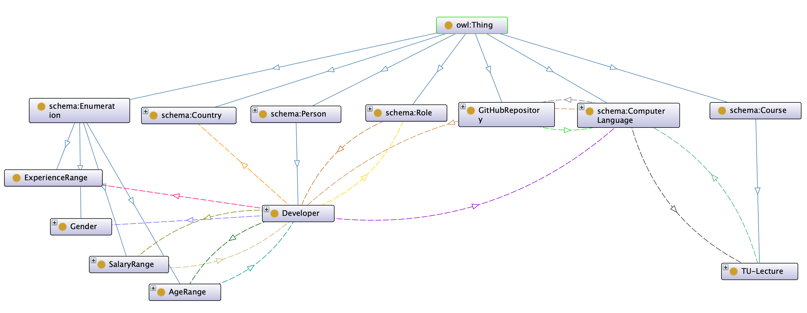

```{r setup, include=FALSE}
knitr::opts_chunk$set(echo = FALSE)
```

# Task 1: Project Idea

```{r, app.mockup, fig.cap='Mockup of Mobile Start Screen', fig.align="center", out.height="40%"}

```

Our project idea is to create a mobile app (platform independent, using HTML technology)
for students, developers and data scientists.

Based on data from developer surveys, repositories and university lectures, it will
answer questions about location, income, lectures and programming languages.

Specifically we want it to be able to answer the following questions:

* I am living in _(country)_ and want to earn as much money as possible.
  What programming language promises the most income?
* I live in _(country)_, have experience in _(programming language)_
  and want to earn at least _(amount)_ USD per year. Can I achieve this in
  my country, or shall I consider relocating, and where shall I relocate to?
* I can develop in _(programming language)_. Which repository is a good starting
  point to practise?
* I want to learn more about _(programming language)_. Which lectures
  at TU Wien deal with this programming language?

The app displays the four core questions as four tiles.
When selecting a tile, the user is asked for details, like their knowledge, location,
or their desired income level.
Then the app will submit these details and provide the answer to the question.

Figure \ref{fig:app.mockup} shows a mockup of the start screen of the mobile app.

# Task 2: Data Collection

We have been decided on the following four data sources:

* **Kaggle User Survey** (László Király)$\hfill\break$
  Data Scientists, Country, Job Role, Programming Language, Income
* **StackOverflow User Survey** (Cem Bicer)$\hfill\break$
  Software Developer, Country, Job Role, Programming Language, Income
* **GitHub Repositories Data** (Helmuth Breitenfellner)$\hfill\break$
  Repository URL, Popularity, Programming Language, Issues
* **TISS Lectures** (Gerald Weber)$\hfill\break$
  Lectures, Lecturer, Description, Programming Language

## Data 1: Kaggle User Survey

## Data 2: StackOverflow User Survey

## Data 3: GitHub Repositories Data

To obtain the data we were considering two options:

* gathering live data from GitHub, using e.g. the GraphQL API
* downloading collected data from e.g. `ghtorrent.org`.

Both options have their advantages and disadvantages.
At the end we went for downloading collected data, as this required less
manual work (compared to performing one query per language) and
also makes more data available for other questions which might be asked.

The biggest issue was dealing with the large amount of data from `ghtorrent.org`.
The download consists of a file with size 100GB compressed, which then had to be
extracted and analysed.

The download contains the following files:
```
-rw-rw-r-- 1 helmuth idc           310 Jun  1  2019 ORDER
-rw-rw-r-- 1 helmuth idc          5326 Jun  1  2019 README.md
-rw-rw-r-- 1 helmuth idc    1033941154 Jun  1  2019 commit_comments.csv
-rw-rw-r-- 1 helmuth idc   27874983212 Jun  1  2019 commit_parents.csv
-rw-rw-r-- 1 helmuth idc  137449918096 Jun  1  2019 commits.csv
-rw-rw-r-- 1 helmuth idc    1118734835 Jun  1  2019 followers.csv
-rwxrwxr-x 1 helmuth idc          2228 Jun  1  2019 ght-restore-mysql
-rw-rw-r-- 1 helmuth idc           703 Jun  1  2019 indexes.sql
-rw-rw-r-- 1 helmuth idc    7464558601 Jun  1  2019 issue_comments.csv
-rw-rw-r-- 1 helmuth idc    9437001225 Jun  1  2019 issue_events.csv
-rw-rw-r-- 1 helmuth idc     489917235 Jun  1  2019 issue_labels.csv
-rw-rw-r-- 1 helmuth idc    5862007798 Jun  1  2019 issues.csv
-rw-rw-r-- 1 helmuth idc      25594106 Jun  1  2019 organization_members.csv
-rw-rw-r-- 1 helmuth idc  116067628357 Jun  1  2019 project_commits.csv
-rw-rw-r-- 1 helmuth idc    6189106041 Jun  1  2019 project_languages.csv
-rw-rw-r-- 1 helmuth idc     663446623 Jun  1  2019 project_members.csv
-rw-rw-r-- 1 helmuth idc      23548935 Jun  1  2019 project_topics.csv
-rw-rw-r-- 1 helmuth idc   23464280056 Jun  1  2019 projects.csv
-rw-rw-r-- 1 helmuth idc    6029885297 Jun  1  2019 pull_request_comments.csv
-rw-rw-r-- 1 helmuth idc    5059804548 Jun  1  2019 pull_request_commits.csv
-rw-rw-r-- 1 helmuth idc    7720141155 Jun  1  2019 pull_request_history.csv
-rw-rw-r-- 1 helmuth idc    2715930046 Jun  1  2019 pull_requests.csv
-rw-rw-r-- 1 helmuth idc   11886216368 Jun  1  2019 repo_labels.csv
-rw-rw-r-- 1 helmuth idc             0 Jun  1  2019 repo_milestones.csv
-rw-rw-r-- 1 helmuth idc         18833 Jun  1  2019 schema.sql
-rw-rw-r-- 1 helmuth idc    2767031027 Jun  1  2019 users.csv
-rw-rw-r-- 1 helmuth idc    5769651559 Jun  1  2019 watchers.csv

```

Relevant for our use case are the files `projects.csv` and `issues.csv`.

As a first step, the data was filtered and merged, using an _R_ script.
This script is called `transform.R`.

Only original repositories (not forked ones)
were taken into account, and only those which have
been forked more than 50 times (as a measure of _popularity_)
were looked at.

Similarly the issues per repository were counted.
Only repositories with at least one issue are considered.

As an output the script created a combined file, `repos_issues.csv`.
Here some sample lines from this script:

```
id,url,description,language,forks,issues
3,https://api.github.com/repos/matplotlib/basemap,,C++,211,515
6,https://api.github.com/repos/cocos2d/cocos2d-x,cocos2d-x for C++,C++,5715,19559
```

Overall, 95576 repositories from GitHub have been created as output in CSV format.

## Data 4: TISS Lectures

# Task 3: Ontology

```{r ontology, fig.cap="Ontology Diagram", out.width="100%"}

```

The ontology developed is depicted in Figure \ref{fig:ontology}.

# Task 4: Knowledge Graph

## Kaggle User Survey

## StackOverflow User Survey

## GitHub Repositories Data

The CSV file created from the data gathering and compilation, as described
in the Task 2 description,
is then processed using a Python script to create a Turtle RDF file. Here is just the
representation of the first two repositories:

```
@prefix rdf: <http://www.w3.org/1999/02/22-rdf-syntax-ns#>
@prefix schema: <http://schema.org/>
@prefix group1: <http://www.semanticweb.org/sws/ws2019/group1#>
@prefix xsd: <http://www.w3.org/2001/XMLSchema#>

<https://api.github.com/repos/matplotlib/basemap> rdf:type group1:GitHubRepository ;
    group1:isDevelopedIn group1:Cplusplus ;
    schema:name "matplotlib/basemap"^^xsd:string ;
    group1:issues "515"^^xsd:integer ;
    group1:popularity "211"^^xsd:integer .

<https://api.github.com/repos/cocos2d/cocos2d-x> rdf:type group1:GitHubRepository ;
    group1:isDevelopedIn group1:Cplusplus ;
    schema:name "cocos2d/cocos2d-x"^^xsd:string ;
    group1:issues "19559"^^xsd:integer ;
    group1:popularity "5715"^^xsd:integer .
```

The most tedious task of the cleanup is to make the programming languages of
GitHub match with them from the other data sources.
E.g. in GitHub it is written `C++`, while in the other data sources this language
is referred to `Cplusplus`.

## TISS Lectures

# Task 5: Triple Store

For storing the data we were using [Jena](https://jena.apache.org).
We have installed an instance on the Internet for easier collaboration and app deployment.

# Task 6: SPARQL Queries

These are just two sample SPARQL queries we have been developing.

### Query 1: Which TU lectures deal with a specific programming language?

```
PREFIX rdf: <http://www.w3.org/1999/02/22-rdf-syntax-ns#>
PREFIX group1: <http://www.semanticweb.org/sws/ws2019/group1#>
PREFIX schema: <http://schema.org/>

SELECT ?name ?programming_language
WHERE {
  ?lecture schema:name ?name .
  ?lecture group1:dealsWith ?programming_language .
  FILTER (?programming_language = ${language})
}
LIMIT 25
```

### Query 2: With my income wish, role and programming language skills - shall I stay or shall I go?

```
PREFIX rdf:<http://www.w3.org/1999/02/22-rdf-syntax-ns#>
PREFIX group1:<http://www.semanticweb.org/sws/ws2019/group1#>
PREFIX schema:<http://schema.org/>
PREFIX dbpedia:<http://dbpedia.org/resource/>
PREFIX rdfs:<http://www.w3.org/2000/01/rdf-schema#>
PREFIX sc:<http://purl.org/science/owl/sciencecommons/>
PREFIX xsd:<http://www.w3.org/2001/XMLSchema#>

ASK
WHERE {
  ?developer a group1:Developer .
  ?developer schema:homeLocation ?country .
  ?developer group1:developsIn ?language .
  ?developer group1:hasRole ?role .
  {
    SELECT ?country (AVG(?avgRange) as ?averageK)
    WHERE {
        ?developer a group1:Developer .
        ?developer group1:hasRole ?role .
        ?developer schema:homeLocation ?country .
        ?developer group1:developsIn ?language .
      ?developer group1:hasSalaryRange ?salaryRange .
      ?salaryRange group1:minSalary ?minSalary .
      ?salaryRange group1:maxSalary ?maxSalary.
      BIND ((?minSalary + ?maxSalary)/2 AS ?avgRange)
    }
    GROUP BY ?country
  }
  {
    SELECT ?country (AVG(?salaryValue) as ?averageS)
    WHERE {
      ?developer a group1:Developer .
      ?developer group1:hasRole ?role .
      ?developer schema:homeLocation ?country .
      ?developer group1:developsIn ?language .
      ?developer group1:salary ?salaryValue .
    }
    GROUP BY ?country
  }
  BIND ((?averageK + ?averageS)/2 as ?average)
  FILTER (?language = ${language} && ?country = ${country} &&
          ?average > "${salary}"^^xsd:integer && ?role = ${role})
}
GROUP BY ?country ?average
```


# Task 7: App Implementation

We used `jquery` when implementing the app.
The app is interacting with Apache Jena using SOH - _SPARQL over HTTP_.