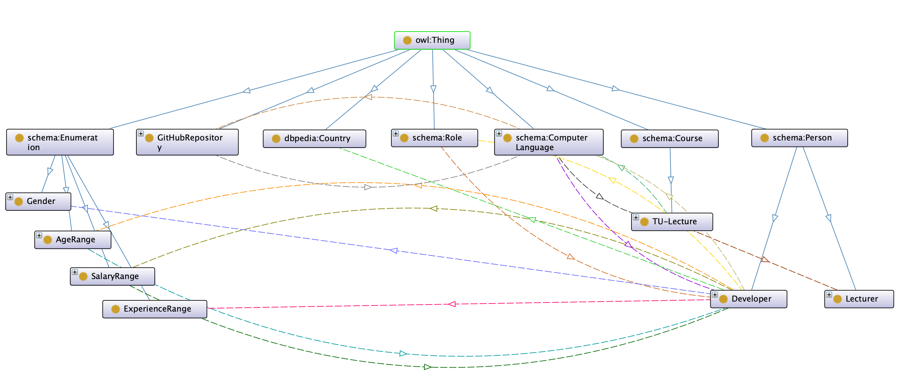

```{r setup, include=FALSE}
knitr::opts_chunk$set(echo = FALSE)
```

# Task 1: Project Idea

```{r, app.mockup, fig.cap='Mockup of Mobile Start Screen', fig.align="center", out.height="40%"}

```

Our project idea is to create a mobile app (platform independent, using HTML technology)
for students, developers and data scientists.

Based on data from developer surveys, repositories and university lectures, it will
answer questions about location, income, lectures and programming languages.

Specifically we want it to be able to answer the following questions:

* **[Study]** As a student I want to learn language _(programming language)_. Which courses should I take?
* **[Location]** As a _(profession)_ I live in _(country)_ and I can program in _(programming language)_ and I want at least _(amount)_. Should I stay our should I go?
* **[Money]** As a student, I live in _(country)_. I want to learn a language which offers the most salary prospect in my country. Which languages shall I consider?
* **[Jobs]** I want to practise language _(programming language)_. Which repositories should I look at, as they are most popular and written in this language?


The app displays the four core questions as four tiles.
When selecting a tile, the user is asked for details, like their knowledge, location,
or their desired income level.
Then the app will submit these details and provide the answer to the question.

Figure \ref{fig:app.mockup} shows a mockup of the start screen of the mobile app.

# Task 2: Data Collection

We have the following four data sources:

* **Kaggle User Survey** (László Király)$\hfill\break$
  Data Scientists, Country, Job Role, Programming Language, Income
* **StackOverflow User Survey** (Cem Bicer)$\hfill\break$
  Software Developer, Country, Job Role, Programming Language, Income
* **GitHub Repositories Data** (Helmuth Breitenfellner)$\hfill\break$
  Repository URL, Popularity, Programming Language, Issues
* **TISS Lectures** (Gerald Weber)$\hfill\break$
  Lectures, Lecturer, Description, Programming Language

## Data 1: Kaggle User Survey

## Data 2: StackOverflow User Survey

The 2018 survey results are publicly available\footnote{survey description: \url{https://insights.stackoverflow.com/survey/2018}, download page: \url{https://insights.stackoverflow.com/survey}, last seen on 2020-02-10} where each row represents a single survey instance of a specific user. Each column describes a question of the survey and the rows contain the answer of the user. The original StackOverflow user survey 2018 results consists of a CSV file with over 90.000 entries and over 40 columns. Obviously, there were lots of data we didn't need for our application use case, therefore we removed unused columns such as "Do you program as a hobby?". Also, for the sake of simplicity and efficiency we stripped the 90.000+ entries down to around 700, which we decided to do so because it makes no difference for the ontology how many instances we use.

As we had another similar developer survey (Kaggle), we had to harmonize these data. For instance, we had the developer role "Software Engineer" in Kaggle and "Front-end developer" in StackOverflow. We decided to merge them to a single "Software Engineer" to have a simpler and better understandable ontology.

## Data 3: GitHub Repositories Data

To obtain the data we were considering two options:

* gathering live data from GitHub, using e.g. the GraphQL API
* downloading collected data from e.g. `ghtorrent.org`.

Both options have their advantages and disadvantages.
At the end we went for downloading collected data, as this required less
manual work (compared to performing one query per language) and
also makes more data available for other questions which might be asked.

The biggest issue was dealing with the large amount of data from `ghtorrent.org`.
The download consists of a file with size 100GB compressed, which then had to be
extracted and analysed.

The download contains the following files:
```
-rw-rw-r-- 1 helmuth idc           310 Jun  1  2019 ORDER
-rw-rw-r-- 1 helmuth idc          5326 Jun  1  2019 README.md
-rw-rw-r-- 1 helmuth idc    1033941154 Jun  1  2019 commit_comments.csv
-rw-rw-r-- 1 helmuth idc   27874983212 Jun  1  2019 commit_parents.csv
-rw-rw-r-- 1 helmuth idc  137449918096 Jun  1  2019 commits.csv
-rw-rw-r-- 1 helmuth idc    1118734835 Jun  1  2019 followers.csv
-rwxrwxr-x 1 helmuth idc          2228 Jun  1  2019 ght-restore-mysql
-rw-rw-r-- 1 helmuth idc           703 Jun  1  2019 indexes.sql
-rw-rw-r-- 1 helmuth idc    7464558601 Jun  1  2019 issue_comments.csv
-rw-rw-r-- 1 helmuth idc    9437001225 Jun  1  2019 issue_events.csv
-rw-rw-r-- 1 helmuth idc     489917235 Jun  1  2019 issue_labels.csv
-rw-rw-r-- 1 helmuth idc    5862007798 Jun  1  2019 issues.csv
-rw-rw-r-- 1 helmuth idc      25594106 Jun  1  2019 organization_members.csv
-rw-rw-r-- 1 helmuth idc  116067628357 Jun  1  2019 project_commits.csv
-rw-rw-r-- 1 helmuth idc    6189106041 Jun  1  2019 project_languages.csv
-rw-rw-r-- 1 helmuth idc     663446623 Jun  1  2019 project_members.csv
-rw-rw-r-- 1 helmuth idc      23548935 Jun  1  2019 project_topics.csv
-rw-rw-r-- 1 helmuth idc   23464280056 Jun  1  2019 projects.csv
-rw-rw-r-- 1 helmuth idc    6029885297 Jun  1  2019 pull_request_comments.csv
-rw-rw-r-- 1 helmuth idc    5059804548 Jun  1  2019 pull_request_commits.csv
-rw-rw-r-- 1 helmuth idc    7720141155 Jun  1  2019 pull_request_history.csv
-rw-rw-r-- 1 helmuth idc    2715930046 Jun  1  2019 pull_requests.csv
-rw-rw-r-- 1 helmuth idc   11886216368 Jun  1  2019 repo_labels.csv
-rw-rw-r-- 1 helmuth idc             0 Jun  1  2019 repo_milestones.csv
-rw-rw-r-- 1 helmuth idc         18833 Jun  1  2019 schema.sql
-rw-rw-r-- 1 helmuth idc    2767031027 Jun  1  2019 users.csv
-rw-rw-r-- 1 helmuth idc    5769651559 Jun  1  2019 watchers.csv

```

Relevant for our use case are the files `projects.csv` and `issues.csv`.

As a first step, the data was filtered and merged, using an _R_ script.
This script is called `transform.R`.

Only original repositories (not forked ones)
were taken into account, and only those which have
been forked more than 50 times (as a measure of _popularity_)
were looked at.

Similarly the issues per repository were counted.
Only repositories with at least one issue are considered.

As an output the script created a combined file, `repos_issues.csv`.
Here some sample lines from this script:

```
id,url,description,language,forks,issues
3,https://api.github.com/repos/matplotlib/basemap,,C++,211,515
6,https://api.github.com/repos/cocos2d/cocos2d-x,cocos2d-x for C++,C++,5715,19559
```

Overall, 95576 repositories from GitHub have been created as output in CSV format.

## Data 4: TISS Lectures

The data has been parsed from TISS and consists of lecture descriptions, lecturer information and occuring programming languages parsed from the lecture description.
The entry point of the parse task is the list of available  curriculums\footnote{\url{https://tiss.tuwien.ac.at/curriculum/studyCodes.xhtml?locale=en}, last seen on 2020-02-10} which is not available as simple HTML file. The endpoint presents a HTML based _shell_ which loads the data from the backend via REST calls. To parse the information we used Python with Selenium to interact with the browser and extract the data.
Parsing consists of lookups - for HTML tags with specific class names and content - and clicks - navigate to the interesting content - to extract the required information.
Finally, each linked lecture in the data science curriculum is clicked, loaded and parsed to get the information.

# Task 3: Ontology

```{r ontology, fig.cap="Ontology Diagram", out.width="100%"}

```

When designing the ontology we were reusing existing vocabulary as much as possible.

* `schema:Enumeration`: Our enumerations (e.g. `Gender`, `AgeRange`, or `SalaryRange`)
are subclasses of `schema:Enumeration`.
* `schema:gender`: The (functional) attribute specifying the gender of a person is
taken the `schema` vocabulatory.
* `schema:homeLocation`: The (functional) attribute specifying the home country of a
person is taken from the `schema` vocabulatory.
* `schema:instructor`: The (functional) attribute specifying the lecturer of a lecture
is taken from the `schema` vocabulatory.
* `schema:name`: The data property specifying the name of an instance is taken from
the `schema` vocabulatory.
* `dbpedia:Country`: Countries are matched with corresponding countries from `dbpedia`.
* `schema:ComputerLanguage`: For the programming languages we use entities of `schema:ComputerLanguage`.
* `schema:Course`: The class `TU-Lecture`, representing a lecture at TU Wien, is modelled as a subclass
of `schema:Course`.
* `schema:Person`: The two types of person we deal with, `Developer` and `Lecturer`, are modelled
as subclasses of `schema:Person`.
* `schema:Role`: The developer and data scientiest roles are modelled as subclasses of `schema:Role`.

We have specified attributes like inverse, functional or range and domain for all relations.

The ontology developed is depicted in Figure \ref{fig:ontology}.

# Task 4: Knowledge Graph

## Kaggle User Survey

## StackOverflow User Survey

Every script used for the StackOverflow survey is located in `stackoverflow-survey-2018/individuals/scripts`. There is a `main.py` script that generates RDF files (in XML format) for e.g. country individuals, developer role individuals and age ranges. Which can easily be appended to the ontology file to have individuals defined in it. There is also a script `csv2ttl.py` that generates a Turtle file of the CSV file (filename: `stackoverflow_individuals.ttl`). It creates statements for each row in the results file. This ttl file can then be imported into the Apache Jena triple store.

## GitHub Repositories Data

The CSV file created from the data gathering and compilation, as described
in the Task 2 description,
is processed using a Python script called `RDFize.py` to create a Turtle RDF file.
Below the RDF Turtle representation of two repositories:

```
@prefix rdf: <http://www.w3.org/1999/02/22-rdf-syntax-ns#>
@prefix schema: <http://schema.org/>
@prefix group1: <http://www.semanticweb.org/sws/ws2019/group1#>
@prefix xsd: <http://www.w3.org/2001/XMLSchema#>

<https://api.github.com/repos/matplotlib/basemap> rdf:type group1:GitHubRepository ;
    group1:isDevelopedIn group1:Cplusplus ;
    schema:name "matplotlib/basemap"^^xsd:string ;
    group1:issues "515"^^xsd:integer ;
    group1:popularity "211"^^xsd:integer .

<https://api.github.com/repos/cocos2d/cocos2d-x> rdf:type group1:GitHubRepository ;
    group1:isDevelopedIn group1:Cplusplus ;
    schema:name "cocos2d/cocos2d-x"^^xsd:string ;
    group1:issues "19559"^^xsd:integer ;
    group1:popularity "5715"^^xsd:integer .
```

The most tedious task of the cleanup was to make the programming languages of
GitHub match with them from the other data sources.
E.g. what in GitHub is written as `C++` appears in the other data sources
as `Cplusplus`.

## TISS Lectures

The script which is extracting the data is directly
exporting into Turtle format via (RDFLib\footnote{\url{https://github.com/RDFLib/rdflib}, last seen on 2020-01-10}) and writes the results to disk (file: `tuwel-data-science.ttl`).
This output was directly imported into Apache Jena/Fuseki server via the provided web interface.

Two example lectures extracted and exported into TTL format:

```
@prefix ns1: <http://schema.org/> .
@prefix ns2: <http://www.semanticweb.org/sws/ws2019/group1#> .
@prefix rdf: <http://www.w3.org/1999/02/22-rdf-syntax-ns#> .
@prefix rdfs: <http://www.w3.org/2000/01/rdf-schema#> .
@prefix xml: <http://www.w3.org/XML/1998/namespace> .
@prefix xsd: <http://www.w3.org/2001/XMLSchema#> .

<https://tiss.tuwien.ac.at/course/courseDetails.xhtml?courseNr=188399&semester=2019W>
    a ns2:TU-Lecture ;
    ns1:name "Introduction to Semantic Systems" ;
    ns2:courseId "188.399" ;
    ns2:description "2019W, VU, 2.0h, 3.0EC" ;
    ns2:ects 3.0 ;
    ns2:instructor ns2:Ekaputra_Fajar_Juang,
        ns2:Kiesling_Elmar,
        ns2:Sabou_Reka_Marta,
        ns2:Tjoa_A_Min .
        
<https://tiss.tuwien.ac.at/course/courseDetails.xhtml?courseNr=188995&semester=2019W>
    a ns2:TU-Lecture ;
    ns1:name "Data-oriented Programming Paradigms" ;
    ns2:courseId "188.995" ;
    ns2:dealsWith ns2:Python ;
    ns2:description "2019W, VU, 2.0h, 3.0EC" ;
    ns2:ects 3.0 ;
    ns2:instructor ns2:Böck_Sebastian,
        ns2:Hanbury_Allan,
        ns2:Kiesling_Elmar,
        ns2:Piroi_Florina_Mihaela .
```

# Task 5: Triple Store

For storing the data we were using [Jena](https://jena.apache.org).
We have installed an instance on the Internet for easier collaboration and app deployment.

The upload to Apache Jena was performed using the web interface, which
turned out to be easy.
Biggest problem here was error reporting. Apache Jena is not very verbose
in reporting errors on the UI, even though a helpful error message could often be
found in the logfiles.

## Construct Queries

### Internal Enrichment

We created `CONSTRUCT` queries to enrich the
knowledge graph with inverse relations to the ones created by the scripts.

Here one example:
```
PREFIX group1: <http://www.semanticweb.org/sws/ws2019/group1#>

CONSTRUCT {
  ?ageGroup group1:ageHasDevelopers ?developer
}
WHERE {
  ?developer group1:hasAgeRange ?ageGroup
}
LIMIT 25
```

A `CONSTRUCT` query creates triplets, however these triplets
are not stored back into the knowledge graph but only returned
as results.
For persisting the enriched knowledge one can use a _SPARQL 1.1_ `INSERT DATA` query:

```
PREFIX group1: <http://www.semanticweb.org/sws/ws2019/group1#>

INSERT {
  ?ageGroup group1:ageHasDevelopers ?developer
}
WHERE {
  ?developer group1:hasAgeRange ?ageGroup
}
```

## External Enrichment

We were linking with `dbpedia` to get the name of the countries
in English and German.

```
PREFIX dbpedia: <http://dbpedia.org/resource/>
PREFIX schema: <http://schema.org/>
PREFIX rdfs: <http://www.w3.org/2000/01/rdf-schema#>

CONSTRUCT
{ ?country rdfs:label ?countryName }
WHERE {
  { SELECT distinct ?country
    WHERE {
      ?developer schema:homeLocation ?country .
    }
  }
  SERVICE <https://dbpedia.org/sparql> {
    ?country rdfs:label ?countryName .
    FILTER (lang(?countryName) = 'en' || lang(?countryName) = 'de')
  }

}
```

# Task 6: SPARQL Queries

These are just two sample SPARQL queries we have been developing.

### Query 1: [Study] As a student I want to learn language _(programming language)_. Which courses should I take?

```
PREFIX rdf: <http://www.w3.org/1999/02/22-rdf-syntax-ns#>
PREFIX group1: <http://www.semanticweb.org/sws/ws2019/group1#>
PREFIX schema: <http://schema.org/>

SELECT ?name
WHERE {
  ?lecture schema:name ?name .
  ?lecture group1:dealsWith ?programming_language .
  FILTER (?programming_language = ${language})
}
ORDER BY ?name
LIMIT 25
```

### Query 2: [Location] As a _(profession)_ I live in _(country)_ and I can program in _(programming language)_ and I want at least _(amount)_. Should I stay our should I go?  

```
PREFIX rdf:<http://www.w3.org/1999/02/22-rdf-syntax-ns#>
PREFIX group1:<http://www.semanticweb.org/sws/ws2019/group1#>
PREFIX schema:<http://schema.org/>
PREFIX dbpedia:<http://dbpedia.org/resource/>
PREFIX rdfs:<http://www.w3.org/2000/01/rdf-schema#>
PREFIX sc:<http://purl.org/science/owl/sciencecommons/>
PREFIX xsd:<http://www.w3.org/2001/XMLSchema#>

ASK
WHERE {
  ?developer a group1:Developer .
  ?developer schema:homeLocation ?country .
  ?developer group1:developsIn ?language .
  ?developer group1:hasRole ?role .
  {
    SELECT ?country (AVG(?avgRange) as ?averageK)
    WHERE {
        ?developer a group1:Developer .
        ?developer group1:hasRole ?role .
        ?developer schema:homeLocation ?country .
        ?developer group1:developsIn ?language .
      ?developer group1:hasSalaryRange ?salaryRange .
      ?salaryRange group1:minSalary ?minSalary .
      ?salaryRange group1:maxSalary ?maxSalary.
      BIND ((?minSalary + ?maxSalary)/2 AS ?avgRange)
    }
    GROUP BY ?country
  }
  {
    SELECT ?country (AVG(?salaryValue) as ?averageS)
    WHERE {
      ?developer a group1:Developer .
      ?developer group1:hasRole ?role .
      ?developer schema:homeLocation ?country .
      ?developer group1:developsIn ?language .
      ?developer group1:salary ?salaryValue .
    }
    GROUP BY ?country
  }
  BIND ((?averageK + ?averageS)/2 as ?average)
  FILTER (?language = ${language} && ?country = ${country} && ?average > "${salary}"^^xsd:integer && ?role = ${role})
}
GROUP BY ?country ?average
```


### Query 3: [Money] As a student, I live in _(country)_. I want to learn a language which offers the most salary prospect in my country. Which languages shall I consider? 

```
PREFIX rdf:<http://www.w3.org/1999/02/22-rdf-syntax-ns#>
PREFIX group1:<http://www.semanticweb.org/sws/ws2019/group1#>
PREFIX schema:<http://schema.org/>

SELECT distinct ?language
WHERE {
  ?developer a group1:Developer .
  ?developer schema:homeLocation ${country} .
  ?developer group1:developsIn ?language .
  ?developer group1:hasSalaryRange ?salaryRange .
  ?salaryRange group1:minSalary ?minSalary .
  ?salaryRange group1:maxSalary ?maxSalary .
  BIND ((?minSalary + ?maxSalary)/2 AS ?avgRange)
}
GROUP BY ?language
ORDER BY DESC(AVG(?averageK))
LIMIT 25
```


### Query 4: [Jobs] I want to practise language _(programming language)_. Which repositories should I look at, as they are most popular and written in this language?

```
PREFIX rdf:<http://www.w3.org/1999/02/22-rdf-syntax-ns#>
PREFIX group1:<http://www.semanticweb.org/sws/ws2019/group1#>
PREFIX schema:<http://schema.org/>

SELECT ?name
WHERE {
  ?repository group1:isDevelopedIn ${language} .
  ?repository group1:popularity ?popularity .
  ?repository schema:name ?name .
}
ORDER BY DESC(?popularity)
LIMIT 25
```


# Task 7: App Implementation

The app is a simple mobile-friendly web-based application.
We used [Bootstrap](https://getbootstrap.com/) for the styling,
[jQuery](https://jquery.com/) for the DOM manipulation and
`fetch` together with `async/await` for HTTP calls.

The interaction with Apache Jena is using SOH - _SPARQL over HTTP_.

To avoid dealing with _CORS_ (Cross-Origin Resource Sharing) issues,
we have deployed the app in the same server as Apache Jena.
It is accessible at https://jena.helmuth.at/app. For security reasons we have
added username and password protection. Please use the following credentials
to access the app (https://jena.helmuth.at/app) or the Jena Server (https://jena.helmuth.at/):

* **Username:** `group1`
* **Password:** `gurus2020`

## Auxiliary Queries

The dropdown select boxes receive their options through separate _SPARQL_ queries.

When the list of possible countries is presented, the following logic is used:

* show the 10 countries with the most developers
* show all member states of the European Union

For this, a federated search is used, using the attribute `dbpedia:Category:Member_states_of_the_European_Union` from dbpedia.
